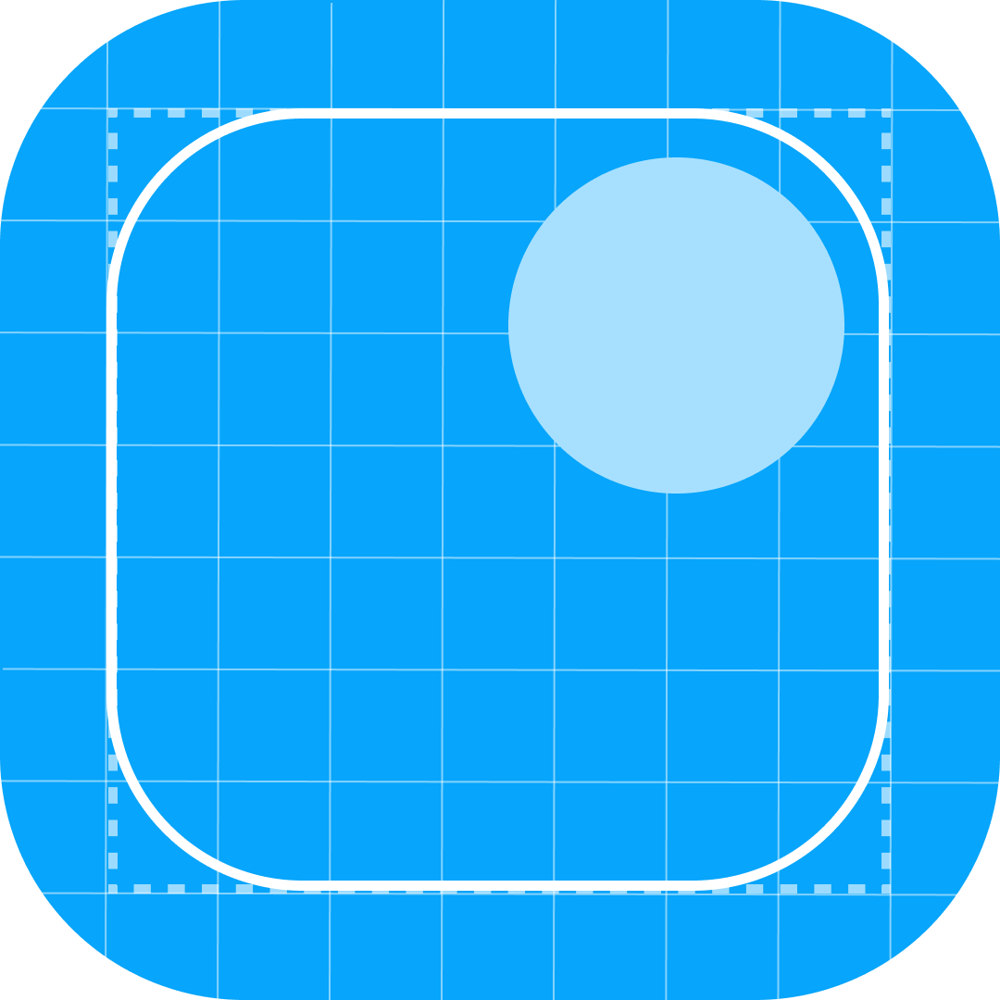

<div align="center">



# GetRounded

**Drop an image. Round the corners. Save it back.**

A tiny desktop app for one job — rounding the corners of an image without
opening Photoshop, Figma, or uploading anything to a website.

[](https://github.com/mustafa-patharia/get-rounded/releases/latest)
[](LICENSE)
[](https://buymeachai.in/mustafapatharia)

macOS &middot; Windows &middot; Linux

</div>

---

## Download

Grab the build for your platform from the
**[latest release](https://github.com/mustafa-patharia/get-rounded/releases/latest)**:

| Platform | File | How to run |
| -------- | ---- | ---------- |
| **macOS** | `GetRounded-1.0-macOS.zip` | Unzip, drag `GetRounded.app` to Applications, open it |
| **Windows** | `GetRounded-1.0-Windows.zip` | Unzip, double-click `GetRounded.bat` |
| **Linux** | `GetRounded-1.0-Linux.tar.gz` | Extract, run `./GetRounded.sh` |

> **Requires Python 3.10 or newer.** Every launcher creates its own virtual
> environment on first run and installs the single dependency, so there is
> nothing else to set up. First launch takes a few seconds; later ones are
> instant.
>
> On macOS the app is unsigned — right-click it and choose **Open** the first
> time, then it launches normally.

## Why

Rounding the corners of a screenshot is a five-second job that usually costs
five minutes: launch a design tool, import, draw a mask, export, hunt for the
file. The online alternatives want you to upload your screenshots to a
stranger's server.

GetRounded is a single window. Drop the image in, drag the slider, hit save.
The rounded PNG appears next to the original. Nothing touches the network — the
app has no network code, and vendors its only front-end dependency locally so it
works on a plane.

## Features

- **Drag and drop**, anywhere on the window — or click to browse
- **Live preview** on a checkerboard, so you can actually see the transparency
- **Corner guides** that trace the exact curve your image is being cut to
- **Radius as a percentage** of the shorter side, so one setting looks right on
  a 400 px avatar and a 4K screenshot alike
- **Saves beside the original** as `name-rounded.png`; your source file is never
  modified
- **Dark mode**, following the system setting, with a manual toggle
- **Fully offline.** No uploads, no telemetry, no accounts

## Usage

1. **Add images** — drag files onto the window, or click the drop zone for a
   file dialog. Multiple files at once is fine.
2. **Set the radius** — drag the slider. The preview updates live and the
   readout shows both the percentage and the resulting pixel radius. Corner
   guides bend to match the curve while you adjust.
3. **Save** — click **Save rounded**. Each image is written next to its original
   as `name-rounded.png`.

Output is always PNG. It has to be: JPEG has no alpha channel, so rounded
corners would come out as black or white wedges instead of transparency.

### Choosing a radius

| Radius | Looks like |
| ------ | ---------- |
| 4–8%   | Subtle softening, close to a Material card |
| 10–15% | The default. macOS window / app-screenshot feel |
| 20–25% | Distinctly rounded, good for thumbnails and avatars |
| 50%    | Fully circular on a square image |

## Run from source

```bash
git clone https://github.com/mustafa-patharia/get-rounded.git
cd get-rounded
python3 -m venv .venv
.venv/bin/pip install -r requirements.txt
.venv/bin/python app.py
```

Or use the launcher for your platform — `GetRounded.command` (macOS),
`GetRounded.bat` (Windows), `GetRounded.sh` (Linux). Each one bootstraps the
virtual environment by itself.

To build the macOS app bundle with the real Dock icon:

```bash
./make_app.sh        # produces GetRounded.app
```

`make_app.sh` uses only `sips` and `iconutil`, both built into macOS. Re-run it
after changing `logo.png`. The bundle is a build artifact and is not committed.

## How it works

The UI is a single HTML file rendered inside a native window by
[pywebview](https://pywebview.flowrl.com/). Python owns the filesystem; the page
owns the pixels.

```
┌──────────────────────────────────────────┐
│  index.html — Tailwind UI, canvas render │
│  ▸ roundRect + clip + drawImage          │
│  ▸ corner guides, sweep animation        │
└──────────────┬───────────────────────────┘
               │  js_api bridge (base64 PNG)
┌──────────────▼───────────────────────────┐
│  app.py — pywebview shell                │
│  ▸ native file dialog                    │
│  ▸ drop handler (real file paths)        │
│  ▸ writes name-rounded.png               │
└──────────────────────────────────────────┘
```

Rounding is a three-line canvas operation — build a rounded rectangle path, clip
to it, draw the image. The browser engine handles antialiasing, so the curve is
clean at any size.

**Why Python handles the drop.** A dropped `File` in JavaScript has a name but no
path, so the page alone cannot know where to write the result. pywebview only
attaches the real path (`pywebviewFullPath`) to events that cross into Python, so
the drop is bound on the Python side with `prevent_default=True`. That flag does
double duty: it also stops WebKit from navigating to the dropped file, which
would otherwise replace the entire app with a picture.

The same rule applies to links. Anything marked `data-ext` is routed through
`Api.open_url` and opened in the real browser, because a plain `<a href>` inside
a webview navigates the app window.

### Files

| File | Purpose |
| ---- | ------- |
| `app.py` | Native window, file dialog, drop handling, saving |
| `index.html` | The complete UI — markup, styles, and logic |
| `tailwind.js` | Tailwind, vendored locally so the app works offline |
| `logo.png` | App icon, also the source for the macOS `.icns` |
| `make_app.sh` | Builds `GetRounded.app` using built-in macOS tools |
| `release.sh` | Packages the three release archives into `dist/` |
| `requirements.txt` | One dependency: pywebview |

### Design

The interface follows [shadcn/ui](https://ui.shadcn.com/) conventions — the same
HSL token set (`--background`, `--muted`, `--ring`, `--radius`), the same button
and card geometry, light and dark themes. These are hand-written CSS rather than
real shadcn components, which are React source requiring a build step this
project deliberately avoids.

Motion is functional. During a save the image dims and a light bar sweeps across
it, and the result pops back with a spring. All
animation is disabled under `prefers-reduced-motion`.

## Browser mode

`index.html` also runs standalone in a browser, without Python:

```bash
python3 -m http.server 8777    # then open http://localhost:8777/
```

In Chrome or Edge you can pick an output folder once and saves go straight
there. Safari and Firefox lack the File System Access API and fall back to
regular downloads. It must be served over `http://` — the API is blocked on
`file://` origins.

The desktop app is the better experience; browser mode exists as a fallback if
Python is unavailable.

## Troubleshooting

**The window opens blank or unstyled.**
`tailwind.js` is missing. Re-download it:
`curl -sL -o tailwind.js https://cdn.tailwindcss.com/3.4.17`

**Errors during use.** They appear in red in the status line inside the app. For
the full picture, launch with the inspector attached:

```bash
GETROUNDED_DEBUG=1 ./GetRounded.command
```

**Dropping a file replaces the app with the image.** The Python drop handler
failed to bind. Check the terminal for a traceback from `bind()` in `app.py`.

**macOS says the app is damaged or from an unidentified developer.** It is
unsigned. Right-click, choose **Open**, confirm once.

## Roadmap

- Per-corner radii
- Optional padding and background colour behind the rounded image
- Overwrite-in-place mode, with a confirmation
- Presets for common radii
- Signed builds, so the first-launch warning goes away

## Support

GetRounded is free, offline, and has no accounts to sign up for. If it saved you
a trip to Photoshop, you can say thanks with a chai:

<div align="center">

### [☕ Buy me a chai](https://buymeachai.in/mustafapatharia)

</div>

The same link lives in the app — in the footer and in the About panel.

## Licence

[MIT](LICENSE). Made by Mustafa Patharia.
